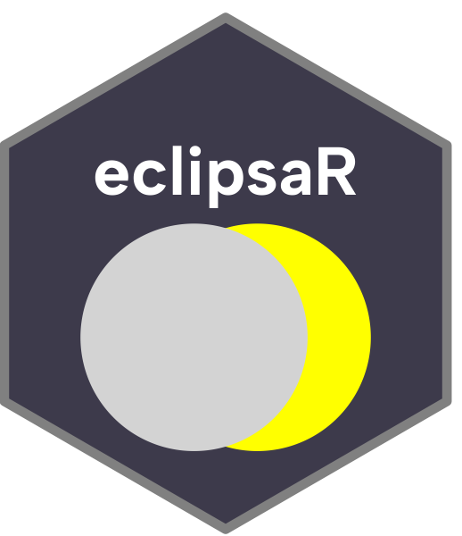

# 🌑 EclipsaR

> *Sun, meet Moon. Moon, meet Sun. Everyone else, meet EclipsaR.*

EclipsaR is a [Quarto](https://quarto.org/) website for anyone who has ever looked up, seen the sky go dark at noon, and thought *"okay but I need MORE of this."* We gather 21st-century eclipse data so you don't have to, and serve it back to you with maps, tables, and weird facts.

Built with 💚 (and an unreasonable amount of `ggplot2`) for [RaukR 2026](https://nbisweden.github.io/workshop-RaukR/).

---

## ✨ What's inside

| Page | What you'll find |
|---|---|
| 🏠 **Home** | A live countdown to the next eclipse, because waiting is easier with a timer |
| 🗺️ **21st Century Eclipses** | An interactive map of every eclipse path this century — plan your chase |
| 📊 **Eclipse Info** | A searchable, sortable table of eclipse data, for the spreadsheet-brained among us |
| 🎉 **Fun Facts** | 22 bite-sized eclipse facts, from Babylonian astronomers to Einstein to angry Chinese dragons |
| 👋 **About Us** | Meet the humans behind this amazing website |

## 🔭 Did you know?

> The Sun is ~400x wider than the Moon *and* ~400x farther away — which is the only reason total eclipses exist at all. Cosmic coincidence, or cosmic conspiracy? We report, you decide. (More facts like this live on the [Fun Facts](fun_facts.qmd) page.)

## 🛠️ Built with

- **[Quarto](https://quarto.org/)** — the engine holding it all together
- **R** — `tidyverse`, `ggplot2`, `plotly`, `ggiraph`, `sf`, `rnaturalearth`, `vistime`, `DT`, `patchwork`, and friends
- **A shared appreciation for the Moon photobombing the Sun**

## 🚀 Running it locally

```bash
# clone it
git clone https://github.com/ma-ulloa/eclipsaR.git
cd eclipsaR

# render + preview the site
quarto preview
```

You'll need [Quarto](https://quarto.org/docs/get-started/) and R with the packages listed above installed.

## 🌒 The team

Four first-year PhD students who decided that eclipses were more fun than their actual dissertations for a week. Say hi on the [About](about.qmd) page.

## 📜 License

GPL-3.0 — see [LICENSE](LICENSE). Share the darkness responsibly.

---

